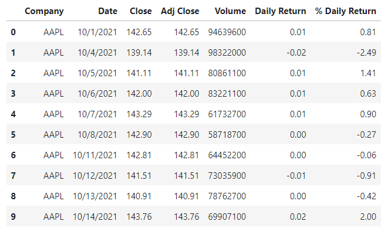
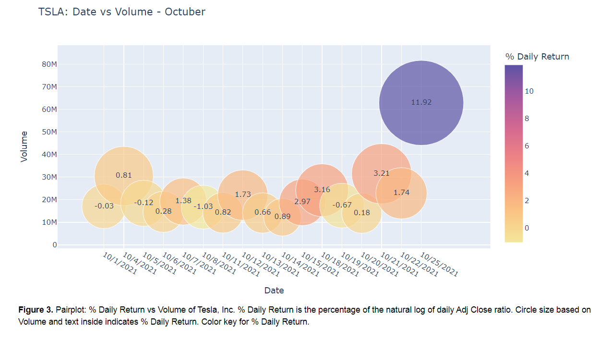
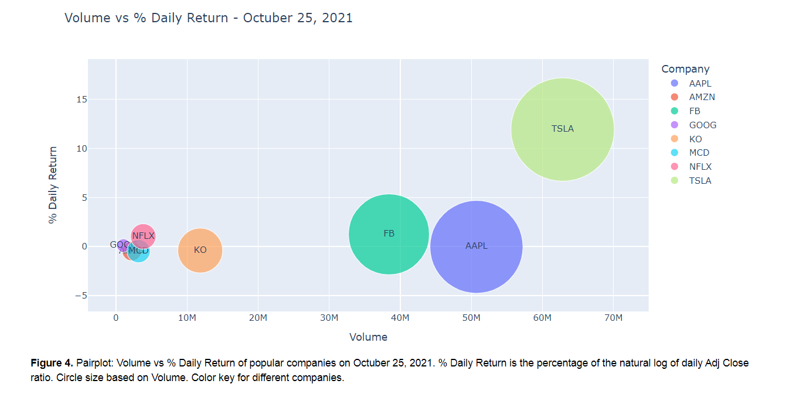
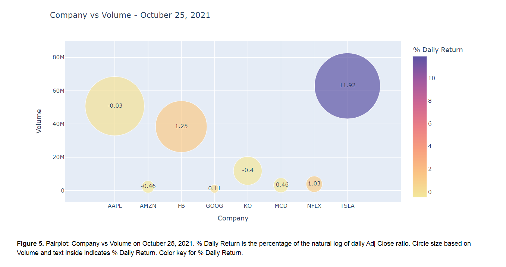
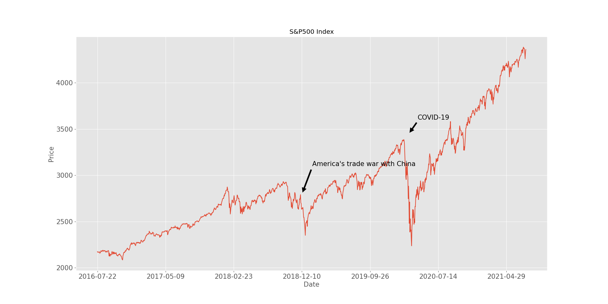

# Yahoo Finance: Project Overview 
* Created a tool that scrape the data from Yahoo Finance and analyze a current situation.
* Scraped website using python. 
* Downloaded data from Yahoo Finance.
* Active stocks Octuber 2021: plots to display stock changes in popular companies.
* Stock market crashes: plot to evaluate it in a period of time. 

## [Link Here!](https://melisadigiacomo.github.io/yahoo_finance/)

## Code and Resources Used  
**Python Version:** 3.7  
**Packages:** time, datetime, pandas, matplotlib, plotly

## Web Scraping  
Tweaked a web scraper to scrape Yahoo Finance data from a certain period of time.
*	Stocks
*	S&P500  
 
# PART 1: Active Stocks Octuber 2021  
The aim was to analyze active stocks of most popular companies in the period from Octuber 1 to Octuber 25, 2021.  

Variables were Companies, Date, Open, High, Low, Close (close price adjusted for splits), Adj Close (Adjusted close price adjusted for splits and dividend and/or capital gain distributions), Volume. Daily Return was calculated as the natural log of daily Adj Close ratio. Currency in USD.  

  

The Adjusted Close and Volume for the companies were analyzed as well as the % Daily Return vs Volume.  

### Adjusted Close vs Volume  

https://user-images.githubusercontent.com/87764919/139294361-f1db5abc-0751-4894-9a3d-fabf96088ec8.mp4

### % Daily Return vs Volume  

https://user-images.githubusercontent.com/87764919/139296052-4387dbe0-77df-4ce9-9b5f-e9dfa48f33be.mp4  

Tesla, Inc. was tendency on October 25, 2021 and here you can see what happened. A drastic shift for TSLA can be observed at the end of the animation, both on volume and % Daily Return.

Let's show that in more detail.  

## Tesla, Inc. 

### Date vs Volume  

  

As observed on figure 3, TSLA showed a 11.92% of Daily Return and 62.85M of Volume on October 25, 2021.  

The question is what happened with the other companies on that date?

## October 25, 2021  

### Volume vs % Daily Return  

  

If we compared the stocks of other popular companies that day, we could see that the closest ones to Tesla, Inc. were Apple, Inc. and Facebook, Inc.

### Company vs Volume 

  

In daily returns, Tesla, Inc.'s closest company was Facebook, Inc. with a 1.25%, 9.5X less than Tesla, Inc. As for Volume, Apple, Inc. was the closest one and showed 1.23X less value.

 
# PART 2: Stock Market Crashes  
The aim was to show stock market crashes in a 5-year period of time.  

* In December 2018, the S&P 500 fell 11 %. America's trade war with China, interest rates and uncertainty in government policy all helped to create a loss of more than 10 percent.  

* With the spread of COVID-19, global stock markets have declined significantly. US indices, including the S&P 500, have fallen close to 30%, bringing us to values previously seen in 2017.

